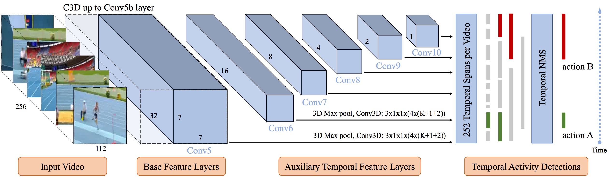
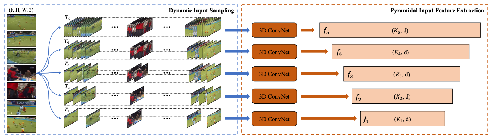
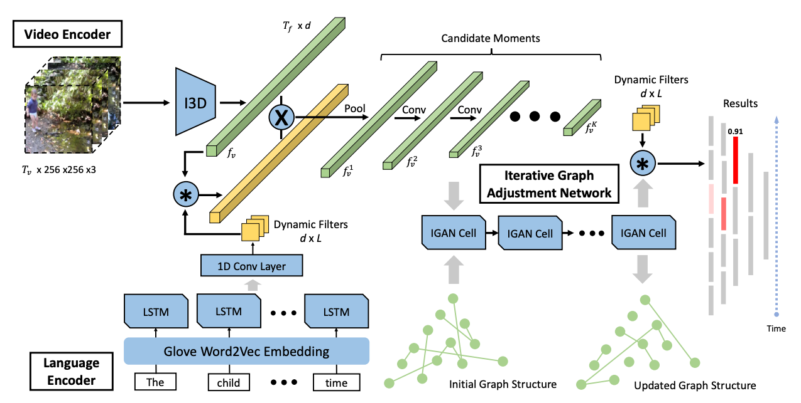

# S3D: Single Shot multi-Span Detector via Fully 3D Convolutional Network

[BMVC 2018](http://bmvc2018.org/) oral paper [S3D: Single Shot multi-Span Detector via Fully 3D Convolutional Network](https://arxiv.org/pdf/1807.08069v2.pdf).

In this paper, we present a novel Single Shot multi-Span Detector for temporal activity detection in long, untrimmed videos using a simple end-to-end fully three-dimensional convolutional (Conv3D) network. Our architecture, named S3D, encodes the entire video stream and discretizes the output space of temporal activity spans into a set of default spans over different temporal locations and scales. At prediction time, S3D predicts scores for the presence of activity categories in each default span and produces temporal adjustments relative to the span location to predict the precise activity duration. Unlike many state-of-the-art systems that require a separate proposal and classification stage, our S3D is intrinsically simple and dedicatedly designed for single-shot, end-to-end temporal activity detection. When evaluating on THUMOS'14 detection benchmark, S3D achieves state-of-the-art performance and is very efficient and can operate at 1271 FPS.

## Network architecture

<p align="center">

## Reference
If you find our work useful, please use the following bibtex to cite our work:
```
@inproceedings{zhang2018s3d,
  author = {Zhang, Da and Dai, Xiyang and Wang, Xin and Wang, Yuan-Fang},
  title = {S3D: Single Shot multi-Span Detector via Fully 3D Convolutional Network},
  booktitle = {Proceedings of the British Machine Vision Conference (BMVC)},
  year = {2018}
}
```

# Dynamic Temporal Pyramid Network: A Closer Look at Multi-Scale Modeling for Activity Detection

[ACCV 2018](http://accv2018.net/) oral paper [Dynamic Temporal Pyramid Network: A Closer Look at Multi-Scale Modeling for Activity Detection](https://arxiv.org/pdf/1808.02536v1.pdf).

Recognizing instances at different scales simultaneously is a fundamental challenge in visual detection problems. While spatial multi-scale modeling has been well studied in object detection, how to effectively apply a multi-scale architecture to temporal models for activity detection is still under-explored. In this paper, we identify three unique challenges that need to be specifically handled for temporal activity detection compared to its spatial counterpart. To address all these issues, we propose Dynamic Temporal Pyramid Network (DTPN), a new activity detection framework with a multi-scale pyramidal architecture featuring three novel designs: (1) We sample input video frames dynamically with varying frame per seconds (FPS) to construct a natural pyramidal input for video of an arbitrary length. (2) We design a two-branch multi-scale temporal feature hierarchy to deal with the inherent temporal scale variation of activity instances. (3) We further exploit the temporal context of activities by appropriately fusing multi-scale feature maps, and demonstrate that both local and global temporal contexts are important. By combining all these components into a uniform network, we end up with a single-shot activity detector involving single-pass inferencing and end-to-end training. Extensive experiments show that the proposed DTPN achieves state-of-the-art performance on the challenging ActvityNet dataset.

## Network architecture

<p align="center">

## Reference
If you find our work useful, please use the following bibtex to cite our work:
```
@inproceedings{zhang2018dtpn,
  author = {Zhang, Da and Dai, Xiyang and Wang, Yuan-Fang},
  title = {Dynamic Temporal Pyramid Network: A Closer Look at Multi-Scale Modeling for Activity Detection},
  booktitle = {The Asian Conference on Computer Vision(ACCV)},
  year = {2018}
}
```


# MAN: Moment Alignment Network for Natural Language Moment Retrieval via Iterative Graph Adjustment

[CVPR 2019](http://cvpr2019.thecvf.com/) paper [MAN: Moment Alignment Network for Natural Language Moment Retrieval via Iterative Graph Adjustment](https://arxiv.org/pdf/1812.00087.pdf).

This research strives for natural language moment retrieval in long, untrimmed video streams. The problem nevertheless is not trivial especially when a video contains multiple moments of interests and the language describes complex temporal dependencies, which often happens in real scenarios. We identify two crucial challenges: semantic misalignment and structural misalignment. However, existing approaches treat different moments separately and do not explicitly model complex moment-wise temporal relations. In this paper, we present Moment Alignment Network (MAN), a novel framework that unifies the candidate moment encoding and temporal structural reasoning in a single-shot feed-forward network. MAN naturally assigns candidate moment representations aligned with language semantics over different temporal locations and scales. Most importantly, we propose to explicitly model moment-wise temporal relations as a structured graph and devise an iterative graph adjustment network to jointly learn the best structure in an end-to-end manner. We evaluate the proposed approach on two challenging public benchmarks Charades-STA and DiDeMo, where our MAN significantly outperforms the state-of-the-art by a large margin.

## Network architecture

<p align="center">

## Reference
If you find our work useful, please use the following bibtex to cite our work:
```
@inproceedings{zhang2018man,
  title={MAN: Moment Alignment Network for Natural Language Moment Retrieval via Iterative Graph Adjustment},
  author={Zhang, Da and Dai, Xiyang and Wang, Xin and Wang, Yuan-Fang and Davis, Larry S},
  journal={The IEEE Conference on Computer Vision and Pattern Recognition (CVPR)},
  year={2019}
}
```

